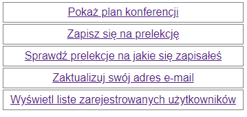
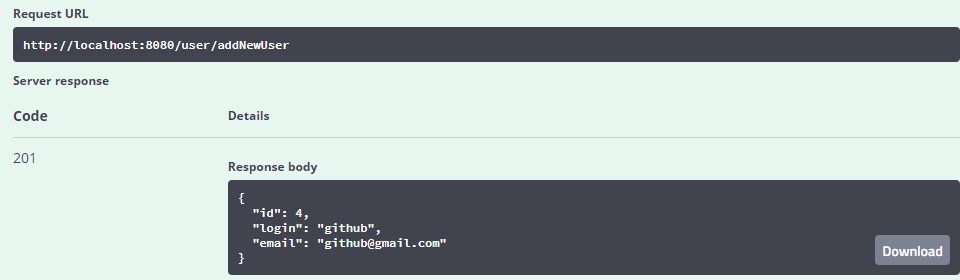
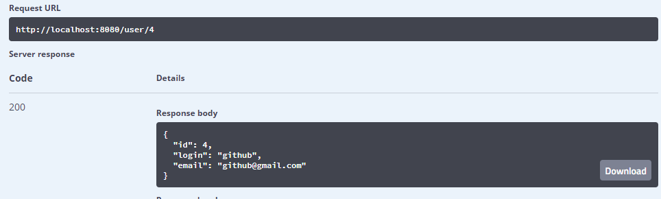
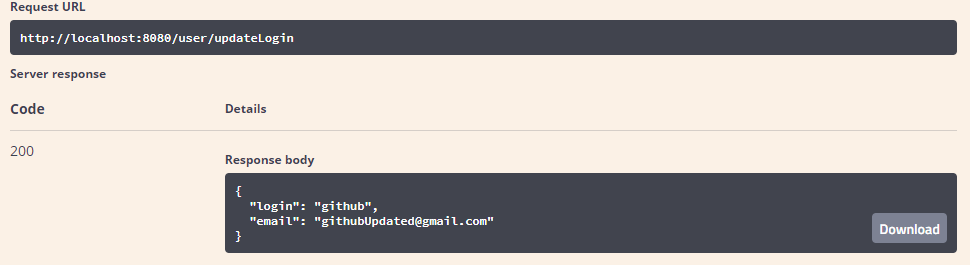

# Projekt Konferencja IT    

## 1. O projekcie
Jest to aplikacja, która obsługuje użytkowników konferencji IT. 
Użytkownik w aplikacji może:
* zobaczyć plan konferencji, 
* zapisać się na prelekcję konferencji,
* sprawdzić, na jakie prelekcje jest już zapisany,
* anulować swoją rezerwację 
* zaktualizować swój e-mail  

Każda prelekcja może pomieścić maksymalnie 5 słuchaczy.
## 2. Stos technologiczny
Projekt jest stworzony przy pomocy:
* Spring Boot
* Baza danych H2 (w pamięci)
* Thymeleaf

## 3. Uruchomienie interfejsu użytkownika
1. Uruchom projekt IT_Conference
2. Użyj podanego linku do otwarcia interfejsu użytkownika: http://localhost:8080/
3. Jeżeli projekt uruchomiony jest poprawnie, powinniśmy otrzymać taki widok: 
   

## 4. Uruchomienie Swagger UI 
1. Uruchom projekt IT_Conference
2. Użyj podanego linku do otwarcia Swagger UI: http://localhost:8080/swagger-ui.html#/
3. Użyj metody POST `/user/addNewUser` aby dodać nowego użytkownika. Jeżeli dane są poprawne, jako odpowiedź aplikacji będzie plik JSON z danymi utworzonego użytkownika.
   
4. Użyj metody GET `/user/{id}` aby pobrać z bazy danych dane użytkownika o id przekazanym w parametrze. 

5. Użyj metody PUT `/user/updateLogin` aby zaktualizować adres e-mail użytkownika. Jako plik JSON podaj login użytkownika, który znajduje się w bazie danych oraz jego nowy e-mail. Jako odpowiedź aplikacji powinieneś otrzymać dane użytkownika z zaktualizowanym e-mailem.
   
6. Użyj metody GET `/prelection/getAll` aby otrzymać wszystkie prelekcje zapisane w bazie danych.
7. Użyj metody POST `/reservation/addReservation/{prelectionId}` aby dodać nową rezerwację. Jako `prelectionId` podaj **ID** prelekcji na jaką chcesz zapisać użytkownika. Jako `userDto` podaj e-mail oraz login użytkownika, który ma zostać zapisany na prelekcję.
8. Użyj metody DELETE `/reservation/deleteReservation/{id}` aby usunąć rezerwację. Jako parametr podaj **ID** rezerwacji, która ma zostać usunięta.
9. Użyj metody GET `/reservation/showReservationByLogin/{login}` aby otrzymać listę rezerwacji, na które zapisał się użytkownik o loginie przekazanym jako parametr adresu URL.
